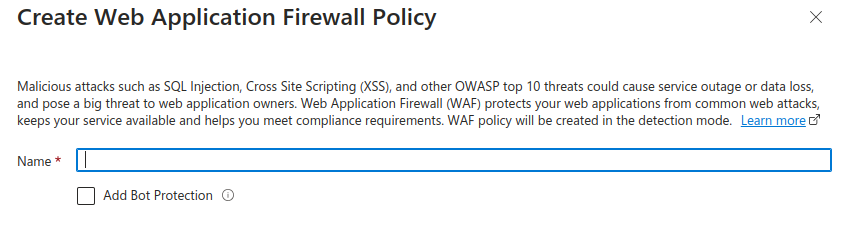
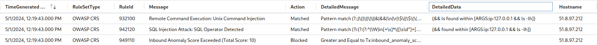

# DVWA deployment

## Resources used
**Container deployment**
https://learn.microsoft.com/es-es/training/modules/run-docker-with-azure-container-instances/2-run-aci

**az container commands**
https://learn.microsoft.com/en-us/cli/azure/container?view=azure-cli-latest#az-container-start


**WAF setup**
https://www.linickx.com/example-azure-web-application-firewall-waf
## Creation of the container instance with DVWA (without WAF)

This instance will be used without the WAF, so it can be access directly with its DNS_NAME_LABEL, which is `DVWA-27433.eastus.azurecontainer.io`

Each command is run independently

```bash
# The container should belong to a resource group (As well as all other resources)
az group create --name CSEC --location eastus 

# random number in the label for the domain
DNS_NAME_LABEL=DVWA-$RANDOM 

# create the container
az container create \
  --resource-group CSEC \
  --name dvwa \
  --image vulnerables/web-dvwa \
  --ports 80 \
  --dns-name-label $DNS_NAME_LABEL \
  --location eastus

# See the container details
az container show \
  --resource-group CSEC \
  --name dvwa

# Stop the container
az container stop \
  --resource-group CSEC \
  --name dvwa

# Start the container
az container start \
  --resource-group CSEC \
  --name dvwa
```

Note: we should wait a few minutes before starting the container again, otherwise the deployment won't be completed under de resource group and the container image will appear with a 'resource not found' message.


# WAF

## WAF setup
There are several resources we need to set up in order to deploy a web aplication (such as DVWA) with WAF enabled. Also all of these resources are under the same resource group we created earlier (CSEC):


### waf-dvwa (Container instance)
  
As we don't want this container to be access directly, we need to set it up with a different configuration. 


Mainly the network part with a private IP, for which we have to create a virtual network (CSEC-vnet)


#### CSEC-vnet (Virtual network)
To create the vnet, we can click where it says new and a tab will open where we only need to name it and accept the defaults:


### waf-logs (Log analytics workspace)
We need to create a Log analytics workspace to store and query the logs from the 
Application gateway and WAF logs. To create it, we only need to name it and use the defaults:


### waf-gateway (Application gateway)
Since a WAF (on azure) needs to be asociated with an Application gateway, which is a load balancer, we have to create it first with the following configuration:


Note that we set up autoscaling but it is not really necesary for out testing purposes on DVWA. But it is important that we select tier `WAF V2`.
#### waf-policy (Application Gateway WAF policy)
For the WAF policy, we select create one and name it in the opened tab:

#### waf-vnet (Virtual network)
We also need to create another vnet for the Application Gateway (the steps are the same as for the CSEC-vnet). Note that currently the Application Gateway and the DVWA container are in separated vnet that we will connect later.


#### waf-public-ip (Public IP address)
In the Frontend configuration we need to create a `public` IP address that is the one we are going to connect to our application (Through the WAF policies).
To create it, we select create and only name it (using the defaults):


#### waf-pool (Backend Pool)
Next, in backends, we need to create a backend pool without targets:


Note that we will come back later to add our container instance as the target backend, that is where the Application Gateway will redirect the traffic to.

#### waf-route-rule (Routing rule)
Next, in configuration we need to create a routing rule as is the only missing part:


We will mainly use defaults for each section:


In the backend targets we need to create backend setting with this configuration:


#### Peering

Now, we need to allow traffic from the waf-vnet into the CSEC-vnet. To do so we create a peering under the waf-vnet resource page with the following configuration:


## WAF testing and logging

Our application (DVWA) is now set up under WAF policies and can be access at `51.8.97.212`. However, as by default the WAF is set up in `detection` mode, we need to change that setting to `prevention` on its resource page:


As we mentioned earlier, detect mode will log possible attacks, but won't block them.

Lastly, the logs can be accesed and queried under the resource `waf-logs` that we created earlier (WAF logs are in the table `AGWFirewallLogs`):


# Attacking DVWA

We can perform attacks on the `dvwa` instance at `DVWA-27433.eastus.azurecontainer.io` or the `waf-dvwa` instance at `51.8.97.212`. However, on the last one we will only be able to perform them if the `waf-policy` is on `detection mode`, otherwise they are blocked automatically.

## Examples

We will perform a command injection and SQL injection attacks to see the WAF response and its logs:

### Command injection

We try to inject an `ls` command:


It's blocked by the WAF and we're redirected to a 403 error page:


In the logs we can see that severar rules checked the HTTP request headers and got a match for a command injection attack. As the 'Detailed data` column shows, `&&` and `&& ls` is a match. And finally, as the anomaly score was exceeded, it is blocked:



### SQL injection
Similar to the command injection, we tried to inject SQL and was blocked by the WAF:


In this case there are 6 rules that matched our query as an injection attack, giving us a higher anomally score and thus blocking the request:
