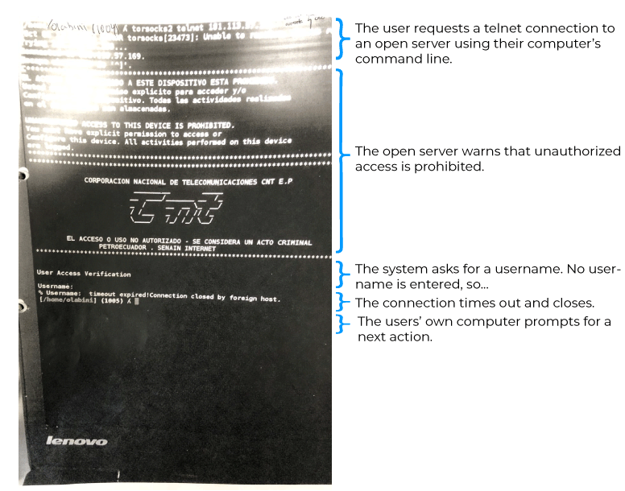

# Ecuadorian Law and Information Security and Privacy

## Team members:
- Sthefano Ulloa
- Kristian Mendoza

## Resources
**Codigo Organico Integral Penal (COIP)** (Actualizado hasta el 9 de febrero de 2024)
https://portal.compraspublicas.gob.ec/sercop/wp-content/uploads/2024/04/CÓDIGO_ORGÁNICO_INTEGRAL_PENAL_-_COIP.pdf

**Ola Bini es culpable y estará un año en prisión** https://www.primicias.ec/noticias/seguridad/ola-bini-culpable-sentencia-fiscalia-ecuador/

**Ola Bini se enfrenta a los esfuerzos de la fiscalia ecuatoriana para anular su absolución en el caso de ciberdelincuencia** https://www.eff.org/es/deeplinks/2024/03ola-bini-faces-ecuadorian-prosecutors-seeking-overturn-acquittal-cybercrime-charge

**Telnet Is Not A Crime: Unconvincing Prosecution Screenshot Leaked in Ola Bini Case**https://www.eff.org/deeplinks/2019/08/telnet-not-crime-unconvincing-prosecution-screenshot-leaked-ola-bini-case

## 1.- Articles of the constitution and COIP that address the topic of information security and information privacy

Please refer to the following articles in the [articles cited](articles_cited.md) file.

## 2. Describe and summarize such articles, and provide their scope

**Article 178** addresses privacy violation, penalizing unauthorized access, interception, recording, or dissemination of personal data, messages, audio, video, or private communications, with a sentence of one to three years imprisonment. Exceptions include personal recordings and publicly available information as per law. Its scope is to protect individuals' privacy rights and regulate data handling, ensuring legal compliance and privacy preservation.

**Article 179**  penalizes revealing secrets causing harm, imposing six months to one year imprisonment. Exceptions include public interest matters. It also penalizes disclosing intimate digital content or sexual material against a person's will, punishable by one to three years imprisonment. Its scope is to safeguard individuals' privacy, prevent harm from secret disclosures, and deter non-consensual sharing of intimate material, ensuring respect for personal boundaries and dignity.

**Article 180** stipulates imprisonment of one to three years for disseminating restricted circulation information, including data protected by legal confidentiality clauses, material from pre-trial investigations by the Prosecutor's Office, and information concerning children's rights violations as per the Organic Code of Childhood and Adolescence. Its scope encompasses safeguarding sensitive information, maintaining legal confidentiality, and protecting minors' rights, ensuring compliance with legal frameworks and preventing harm.

**Article 190** addresses fraudulent appropriation via electronic means, penalizing those using computer systems or electronic networks to misappropriate assets or transfer them without consent, altering their functioning. Imprisonment of one to three years is imposed for manipulating electronic networks or systems, benefiting oneself or others. The same penalty applies to disabling alarm systems, deciphering encrypted data, or breaching electronic security. Its scope is to deter cyber fraud, safeguarding digital assets and maintaining integrity in electronic transactions, ensuring legal compliance and cybersecurity.

**Article 191** penalizes reprogramming or altering identification information of mobile terminal equipment, with imprisonment ranging from one to three years. Its scope is to deter unauthorized modifications to mobile device identifiers, ensuring integrity in telecommunications networks and preventing fraudulent activities such as device tampering or identity theft.

**Article 192** penalizes individuals exchanging, trading, or purchasing databases containing mobile terminal equipment identification information, with imprisonment ranging from one to three years. Its scope is to deter illegal trafficking of mobile device data, protecting individuals' privacy and preventing misuse of personal information for fraudulent purposes, ensuring compliance with data protection regulations and safeguarding telecommunications integrity.

**Article 195** penalizes individuals possessing infrastructure, programs, equipment, databases, or tags enabling reprogramming, modification, or alteration of mobile terminal equipment identification information, with imprisonment ranging from one to three years. Its scope is to prevent the possession of tools facilitating illegal alteration of mobile device identifiers, ensuring the integrity of telecommunications networks and deterring activities contributing to cybercrime and identity fraud.

**Article 211** addresses identity and civil status manipulation, penalizing illegal alterations and false registrations in official documents. Penalties range from one to five years' imprisonment, depending on the severity of the offense. Its scope is to prevent identity fraud, safeguard official document integrity, and ensure accurate registration processes, thereby protecting individuals' rights and preventing legal and social ramifications of identity misrepresentation.

**Article 229** prohibits revealing data from electronic systems, imposing one to three years' imprisonment, or three to five for public servants or bank employees. It aims to deter unauthorized data disclosure, protecting privacy and confidentiality in digital communication, ensuring compliance with data protection laws and maintaining trust in electronic transactions.

**Article 230** penalizes illegal data interception with three to five years' imprisonment. Offenses include unauthorized interception of computer data, signals, or transmissions to obtain information; designing or distributing misleading electronic messages or web pages to redirect users; copying or cloning information from credit or debit cards; and producing or distributing tools for committing such offenses. Its scope is to deter unauthorized access to electronic data, protect digital privacy, and ensure the integrity of electronic transactions, safeguarding individuals' financial and personal information.

**Article 231** penalizes electronic transfer of assets with three to five years' imprisonment. It targets those altering computer systems or data messages to unlawfully transfer or appropriate another person's assets for profit. Similarly, individuals providing bank account data to facilitate illegitimate asset acquisition via electronic transfers are subject to the same penalty. Its scope is to deter fraudulent manipulation of digital systems for financial gain, protecting individuals' assets and ensuring the integrity of electronic transactions.

**Article 232** penalizes attacks on the integrity of computer systems with three to seven years' imprisonment. It targets those destroying, damaging, altering, or causing malfunction to computer data or systems. Penalties apply to those designing, distributing, or executing malicious software and unauthorized alteration of technological infrastructure. The severity increases to five to seven years if the offense affects public service or citizen security-related systems. Its scope is to deter cyberattacks, safeguarding the integrity and functionality of digital systems essential for public services and security.

**Article 233** addresses crimes against legally reserved public information. Destruction or disablement of classified information incurs five to seven years' imprisonment. Public officials obtaining such information electronically face three to five years' imprisonment. For reserved information posing a significant state security risk, revealing it without authorization warrants seven to ten years' imprisonment and six months' public office disqualification, provided no more severe offense is committed. Its scope is to protect classified information, deter unauthorized access, and ensure the integrity of state security measures, safeguarding national interests.

**Article 234** penalizes unauthorized access to computer, telematic, or telecommunications systems with three to five years' imprisonment. Offenses include unauthorized entry or remaining within a system to exploit access, modify websites, redirect data or voice traffic, or offer services without payment to legitimate providers. Its scope is to deter unauthorized exploitation of digital systems, ensuring the integrity and fair use of online services while safeguarding against cyber threats and protecting legitimate service providers.

**Article 354** penalizes espionage by military, police, or intelligence personnel during peacetime with seven to ten years' imprisonment. Offenses include obtaining, disseminating, falsifying, or disabling legally classified information, intercepting or copying military or police-related data, sending documents endangering national security without obligation or reporting to authorities. Hiding relevant information from national authorities or altering military data incurs punishment. During armed conflict, penalties increase to ten to thirteen years' imprisonment. Its scope is to deter espionage activities threatening national security and sovereignty, safeguarding classified information and military operations' integrity.

**Article 470** prohibits recording personal communications without prior knowledge and authorization from the involved parties, except as permitted by law. Illegally obtained information holds no legal validity. Risks, damages, and losses resulting from forced information disclosure are attributable to the initiator, who must provide full reparations. Its scope is to protect individuals' privacy rights, ensuring legal compliance and accountability for unauthorized recording or disclosure of personal communications, safeguarding against privacy violations and ensuring appropriate restitution for damages.

**Article 475** governs the retention, opening, and examination of correspondence and documents,electronic or physical, declaring them inviolable except when authorized by the Constitution or this Code. It allows judges to authorize prosecutors to retain, open, and examine correspondence with sufficient evidence for investigation. Prior notification is required for opening correspondence related to an offense, with confidentiality ensured and witnesses present if necessary. Documents are added to the case if relevant, otherwise returned. Decryption or translation is mandated for coded or foreign-language documents.

**Article 476** regulates the interception of communications or computer data, requiring a reasoned request from the prosecutor to the judge, based on relevant indications for the investigation's purposes. The judge determines the intercepted communication and the duration, up to ninety days, extendable once for ninety days or up to six months for organized crime cases. Information obtained is used solely for authorized processes, with an obligation of secrecy. Any discovered offenses prompt immediate investigation. Intercepting data transmission through telecommunications services requires judicial authorization, respecting professional and religious secrecy. Only pertinent conversations are transcribed, and irrelevant data are deleted, supervised by the judge. Telecom service providers and intercepting personnel must maintain confidentiality except in court. Information storage must comply with legal requirements. Intercepting communications violating children's rights or exacerbating violence is prohibited.

**Article 477.1** governs data preservation, allowing the prosecutor to order natural or legal persons to preserve specific computer data without judicial authorization if there are grounds to suspect vulnerability to loss or modification. This preservation lasts up to ninety days, extendable equally if grounds persist. The National Police can request preservation in flagrant crimes, with notification to the prosecutor within eight hours. Recipients must preserve data immediately, maintaining confidentiality under penalty of criminal liability. Communication service providers must inform issuing authorities if communication involves other providers, facilitating data conservation.

**Article 477.2** grants prosecutors and judges the authority to order any individual or entity within national jurisdiction to present or deliver data stored in a computer system or storage device related to a specific crime investigation. The order may include confidentiality instructions under penalty of criminal sanction. Prosecutors, without judicial authorization, can similarly issue orders for subscriber and traffic data. These measures aim to facilitate data retrieval crucial to criminal investigations while ensuring confidentiality and legal compliance.

**Article 477.3** empowers judges, upon the prosecutor's request, to authorize the search, seizure, and access of computer systems or their data storage devices. They can order the seizure of physical system components and devices for data reading, obtain full data copies, and take actions to render data inaccessible or delete them. The judge's order may extend to other systems containing sought-after data or accessible from the initial system. General rules and limitations for document seizure apply.

**Article 477.4** mandates national authorities to cooperate with foreign counterparts in investigations or proceedings concerning information and communication technology-related crimes or obtaining digital evidence. It allows Ecuadorian authorities to request such information from foreign authorities in accordance with international agreements and domestic law. This provision facilitates cross-border collaboration in combating cybercrimes and ensuring effective handling of digital evidence, aligning with international legal frameworks and Ecuador's obligations.

**Article 477.5** outlines rules for the expedited preservation and disclosure of digital content in international cooperation. It mandates national authorities to preserve and disclose digital content promptly upon request from foreign authorities, following international agreements and domestic law. Requests for preservation of digital content stored in Ecuador will be made through expedited communication channels. Disclosure of such content requires a request for international legal assistance. The competent authority will issue preservation orders to those in control or possession of the digital content, specifying the nature and duration of preservation, extendable up to ninety days. Preserved digital content will only be disclosed to the prosecuting authority or the national authority that issued the preservation order. These rules apply reciprocally to requests made by Ecuadorian authorities acting as petitioners.

**Article 477.6** delineates reasons for denial of expedited preservation or disclosure of digital content. Denials occur when the digital content relates to a political or related offense under Ecuadorian law, or when it jeopardizes Ecuador's sovereignty, security, public order, or other interests. Denial may also stem from reasonable belief that the request execution will be rejected due to lack of proof of the non bis in idem principle.

**Article 477.7** allows national judicial authorities, upon request from a foreign competent authority, to conduct searches, seizures, accesses, or seizures of digital content stored in Ecuador. This applies when similar actions would be permissible in a domestic case. Prompt action is mandated when digital content is deemed vulnerable to loss or modification, or when expedited cooperation is stipulated in an applicable international instrument. These provisions apply reciprocally to requests made by Ecuadorian authorities acting as petitioners.

**Article 477.8** allows foreign competent authorities, without prior request to Ecuadorian authorities, to access digital content stored in Ecuador under two conditions: firstly, when the content is publicly available, and secondly, when access is granted through a computer system located in their territory, with the legal and voluntary consent of the person authorized to disclose it.

**Article 477.9** mandates Ecuador to maintain a permanent contact point for international cooperation, available 24/7. This contact point facilitates technical advice, expedited preservation of digital content in emergencies, evidence collection, suspect location, and immediate transmission of requests to the competent judicial authority for prompt execution, aligning with international agreements and protocols.

**Article 477.10** allows for the interception of data transmissions through a computer system located in Ecuador, upon request from a competent foreign authority. This is permissible if provided for in an international agreement and if interception is allowed in a similar domestic case. The procedure and limits outlined in Article 476 of the Comprehensive Organic Criminal Code must be respected and observed.

## 3.	What kind of crimes or infractions can a person be judged for using those articles?

1. **Interception of Data**: Articles such as 230 and 477.10 address the illegal interception of data without proper authorization, which could include accessing, listening to, diverting, recording, or observing data without consent, potentially leading to charges of unauthorized access to computer systems or interception of communications.

2. **Unauthorized Access and Modification**: Articles like 192 and 234 cover crimes related to unauthorized access to computer systems, networks, or electronic devices, as well as unauthorized modification of data, which could lead to charges of hacking, computer fraud, or unauthorized use of computer resources.

3. **Data Manipulation and Theft**: Articles such as 191 and 231 deal with the fraudulent manipulation of electronic systems to facilitate theft of assets or unauthorized transfers of data, potentially resulting in charges of electronic theft, fraud, or identity theft.

4. **Information Disclosure and Privacy Violations**: Articles like 179 and 470 address the unauthorized disclosure of confidential or private information, including personal data or communications, leading to potential charges of privacy violations, disclosure of secrets, or unauthorized recording of communications.

5. **Cyber Espionage and National Security**: Articles such as 354 and 233 deal with crimes related to espionage, sabotage, or attacks against national security through the illegal acquisition, dissemination, or manipulation of classified or sensitive information, potentially leading to charges of espionage, sabotage, or compromising national security.

## 4.	What kind of evidence could the persecutors use to incriminate someone with this kind of crime?

 
Persecutors can employ various legal mechanisms outlined in the Comprehensive Organic Criminal Code to gather evidence and incriminate individuals suspected of cybercrimes. 

Firstly, **Article 476.4** authorizes the interception and recording of computer data transmissions across a wide range of telecommunications services, ncluding fixed, satellite, mobile, and wireless telephony, as well as services like voice calls, SMS, MMS, data transmission, VoIP, email, social networks, video conferencing, multimedia, among others.This allows prosecutors to monitor digital communications to verify the existence of an offense or identify responsible parties.

Secondly, **Article 477.1** empowers prosecutors to order the preservation of specific computer data without judicial authorization, particularly when there are grounds to suspect the data's vulnerability to loss or modification. This preservation mandate extends to subscriber and traffic data, ensuring the integrity of potential evidence for up to ninety days.

Thirdly, **Article 477.3** grants judges, at the prosecutor's request, the authority to conduct searches, seizures, and accesses of computer systems or data storage devices. Judges can authorize the seizure of physical system components, obtain full data copies, and take actions to render data inaccessible or delete them, facilitating the collection of digital evidence crucial to cybercrime investigations.

Moreover, **Article 477.4** establishes cooperation between national and foreign competent authorities in investigating technology-related crimes and obtaining digital evidence. This cooperation enables prosecutors to request information from foreign authorities in accordance with international agreements and domestic law, enhancing the scope and effectiveness of cybercrime investigations.

Lastly, **Article 477.10** allows for the interception of data transmissions through computer systems located in Ecuador upon request from competent foreign authorities, provided it aligns with international agreements and respects domestic legal procedures. This enables prosecutors to collaborate with foreign counterparts to gather evidence and pursue cybercrime cases across borders.

## 5.	Provide a summary of the Ola Bini's case, and present the main arguments and crimes he was accused of.

Ola Bini, a Swedish computer scientist, found himself embroiled in a lengthy legal battle in Ecuador, accused of "attempted unauthorized access to a public computer system." The case dates back to April 2019 when Bini was arrested in Quito while attempting to leave for Japan. His arrest came shortly after Ecuador revoked Julian Assange's asylum at its embassy in London, leading to Assange's subsequent arrest in the UK.

The prosecution alleged that Bini, using his specialized technical knowledge, attempted to access the systems of the state-owned National Telecommunications Corporation (CNT) without authorization. It was claimed that he sought to obtain information from the digital platforms of Petroecuador and the former National Intelligence Secretariat. However, Bini's defense staunchly denied these charges, pointing out various irregularities in the legal process.

The case against Bini was based on the Article 234 of the Comprehensive Organic Criminal Code, which penalizes unauthorized access to computer, telematic, or telecommunications systems. The main proof presented by the prosecution was a grainy image of a telnet session, which they claimed showed Bini attempting to access the CNT's systems. 

The image is the following: 

With this image—which the lower court had already ruled as not evidence of criminal activity—and the testimony of an expert to the lower court—who never had access to the devices and systems involved in the alleged intrusion—the prosecutor argued that by connecting to a router, Bini performed a partially unauthorized access in an attempt to breach a system provided by the Ecuadorian national telecommunications company (CNT) to a presidency contingency center.

Luis Enríquez from the Cyber Rights Observatory and Technosociety says that what is visible on the screen is evidence that no system entry occurred. "What we see on the screen is Ola Bini's terminal, and precisely a timeout, meaning the connection was unsuccessful (...) it's like passing by a street, seeing the post office building, staying at the window, and leaving."

The court emphasized the need for solid evidence to prove an alleged cybercrime and deemed the telnet session image presented in Bini's case insufficient for this purpose. The court clarified that images susceptible to alteration do not constitute evidence of cybercrime, as they cannot verify whether the commands illustrated in them were actually executed. 

Key arguments in Bini's defense included the lack of solid evidence to support the allegations of cybercrime. The court ruled that a grainy image of a telnet session, presented by the prosecution, was insufficient to prove unauthorized access. Furthermore, expert testimonies emphasized the need for verifiable digital evidence, which was lacking in the case. In January 2022, a Criminal Guarantees Tribunal of the Pichincha Provincial Court decided to discontinue the proceedings against Bini, but the Prosecutor's Office appealed the ruling

The prosecutors appealed the verdict and returned to court using the same image, which failed to demonstrate any criminal activity. In the hearing on March 26th, the Prosecutor's Office claimed that their expert's analysis of the telnet image demonstrated connectivity with the router. The witness likened it to entering someone's property's yard to see if the property's gate is open or closed. Entering the yard is analogous to connecting to the router, the witness said.

However, no examination was conducted on the supposedly affected systems. The expert's testimony was based on his analysis of a report from CNT: he did not have access to CNT's router to verify its configuration. He did not digitally validate whether the events described in the report actually occurred, and he was never asked to verify the existence of an IP address owned or managed by CNT.

The Provincial Court of Pichincha has determined on April 5th that Ola Bini is guilty of the crime of attempted unauthorized access to a public computer system. The court sentenced him to one year in prison and ordered him to pay a fine of 4 basic salaries. 

## 6.	What is your opinion of the case in general and its outcome?

With the case context, we believe that the proof presented by the prosecution was insufficient to establish his guilt. The reliance on a single grainy image of a telnet session, which did not demonstrate any criminal activity, was a weak foundation for the charges of attempted unauthorized access to a public computer system. And the lack of a deeper investigation into the systems involved, makes us, as information security students, question if the Ecuadorian justice system is fair and reliable when it comes to cybercrimes.

The outcome for Ola Bini is concerning, as the court's decision to find him guilty based on insufficient evidence raises questions on how we as civilians can be protected from unjust accusations and irregular legal processes. Furthermore, it seems that the political context surrounding Bini's case, had more weight than the actual evidence presented in the trial.

In conclusion, the case of Ola Bini highlights the absence of digital forensic expertise on the part of the prosecution, the lack of verifiable evidence to support the charges, and the potential for political influence to impact legal proceedings. The outcome of the case is just a reflection of how poorly the Ecuadorian justice system is.

## 7. How do the terms of services of applications like Whatsapp and TikTok align with the privacy laws in Ecuador? What kind of protections Ecuadorian citizens are guaranteed under the law?

Under Ecuadorian law, citizens are guaranteed certain protections regarding their personal data and digital privacy. Some of the key provisions that may apply include:

1. **Article 178**: This article addresses privacy violation and penalizes unauthorized access, interception, recording, or dissemination of personal data. It ensures that individuals have control over their personal information and prohibits its unauthorized use.

2. **Article 229**: Prohibits the revealing of data from electronic systems without authorization, aiming to protect privacy and confidentiality in digital communication.

3. **Article 230**: Addresses illegal data interception and penalizes unauthorized access to electronic data. This provision aims to protect digital privacy and ensure the integrity of electronic transactions.

4. **Article 231**: Penalizes electronic transfer of assets without consent, protecting individuals' assets from fraudulent manipulation of digital systems.

5. **Article 470**: Prohibits recording personal communications without authorization, ensuring individuals' privacy rights are protected.

6. **Article 475**: Governs the retention, opening, and examination of correspondence and documents, electronic or physical, declaring them inviolable except when authorized by law. This ensures that individuals' communications are protected from unauthorized access.

7. **Article 476**: Regulates the interception of communications or computer data, requiring judicial authorization based on relevant indications for investigation purposes. This ensures that interceptions are conducted lawfully and with proper oversight.

8. **Article 477**: Provides provisions for data preservation, disclosure, and international cooperation in criminal investigations involving digital content. This ensures that data is handled appropriately and in accordance with legal procedures.

Meta companies and TikTok, like other digital platforms, outline their data handling practices without enough lever of detail. And even though, there are expections per country under their terms of service, Ecuador does not have a specific mention there. 

However, some of the relevant articles mentioned before show many ways in which these companies can be liable for misuse or at least be in obligation to facilitate the execution of justice. For example, even though articles **178, 229 and 230** may refer to individuals who access private information of others, it may be applied to companies that do not make clear enough what data is being collected from users, or collect data without aproval of users (mainly because of ignorance). 

Furthermore, if for example their information is leaked and some malicious party was to access and misuse the list of contacts from high profiles in their country as well as their hardware identifying information (according to article **192**) a case could be held against that platform.

Also, other articles like **475, 476 and 477** show that the Ecuadorian justice can request information from these companies for individuals under juridical investigations.